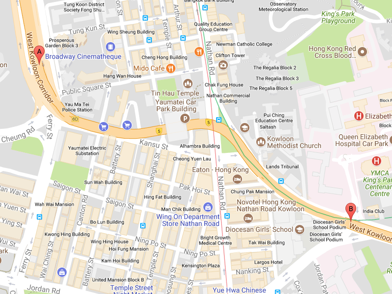
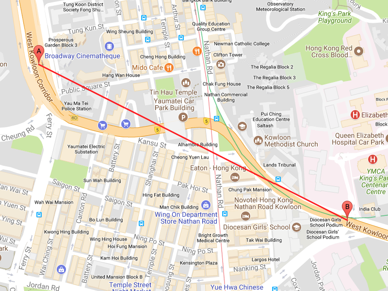
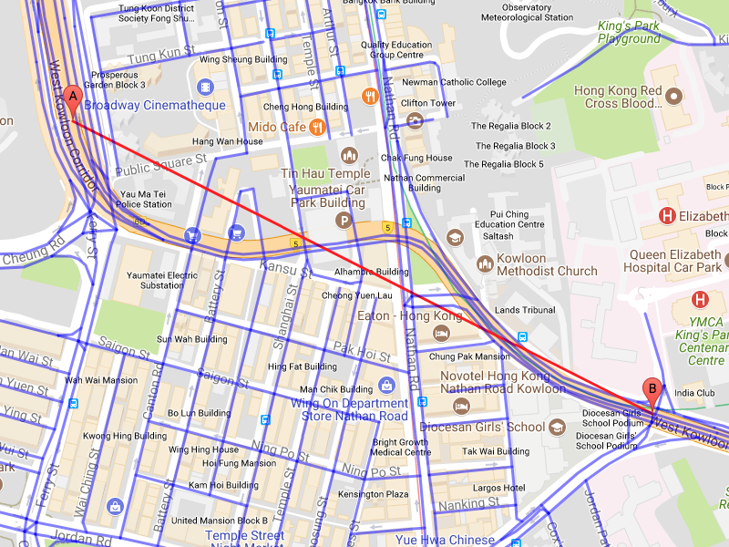
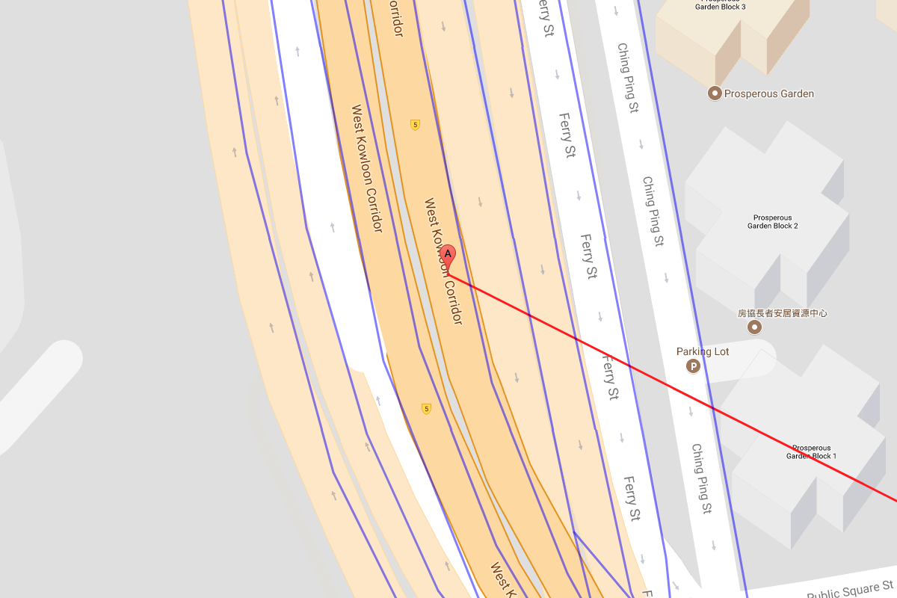
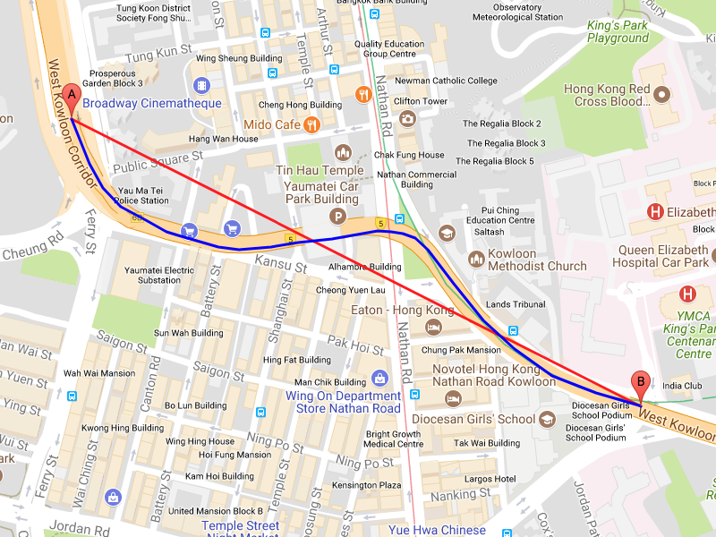
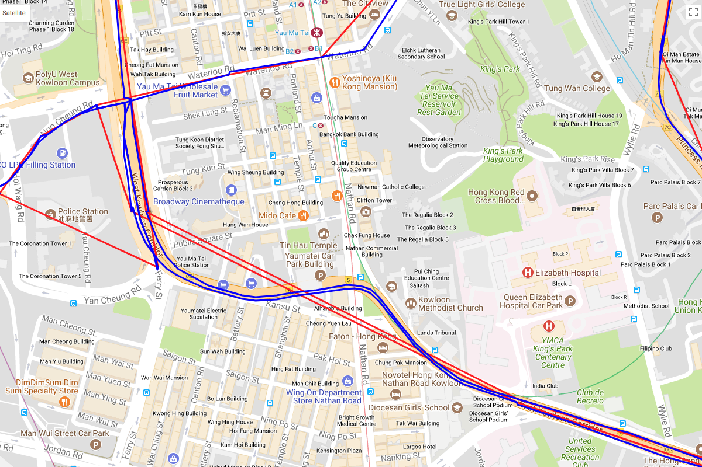
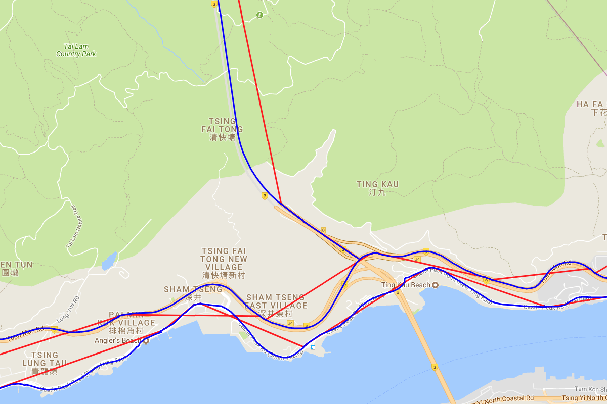
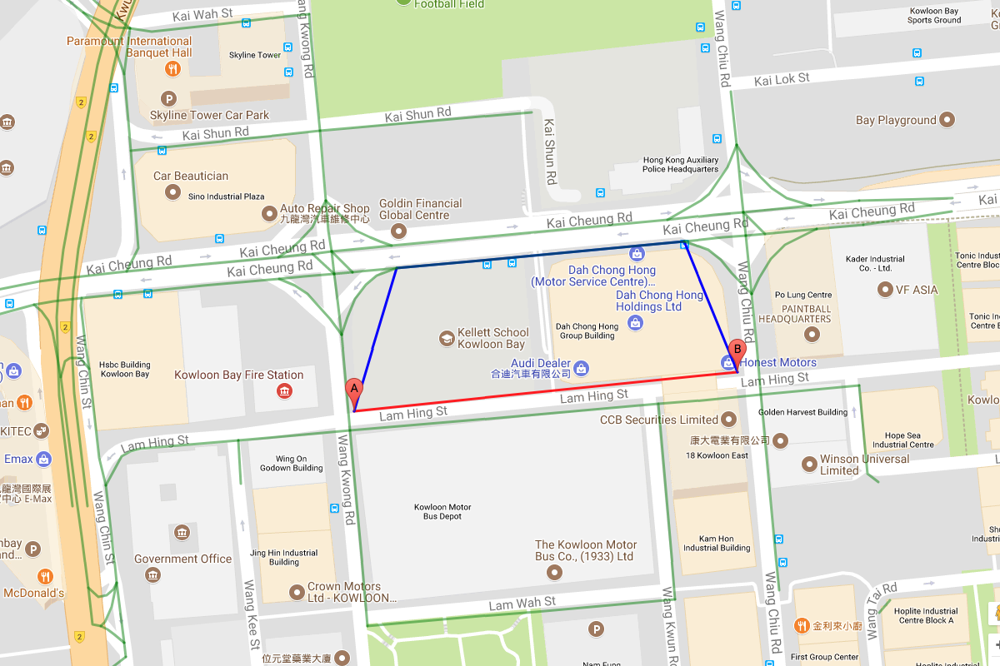

# Path finding with Open Street Map data
Given a starting point and an ending point, try to find out the intermediate points. These intermediate points together forms a drivable path in real world, according to the data collected from [Open Street Map](https://www.openstreetmap.org/).

## Given data
The given data, starting points and end points, and the collected Open Street Map data, are Hong Kong based.

### Start points and end points

Start points and end points are given in pair, with respective latitude and longitude. When ploting on map:

Screenshot 1: A sample pair of given start points (marker A) and end points (marker B)

Obviously, a direct line drawn from starting point to ending point is not a drivable path in real world.

Screenshot 2: A direct line (the red line) drawn from start point (marker A) to end point (marker B)

### Open Street Map data

In order to find a drivable path for any given pairs of starting points and ending points, the collected Open Street Map data will be very useful. These data are a collection of 'ways', each way has multiple coordinate points to form a poly line, and connected ways have a shared starting/ending point. When they are drawn on the map:

Screenshot 3: Open Street Map ways (the blue lines)

With the collected Open Street Map data, we can find the drivable path from starting point to ending point by using shortest path algorithms.

## Algorithm

### Step 1: Converting Open Street Map ways to vertices and edges

As mentioned, each way consists of multiple points, and connected ways share the exact same point as their starting/ending point, a graph can be derived from the data.

Each coordinated point in every ways are the vertices of the graph. And while the points in every ways are ordered sequentially, each pair of neighbouring points has be given an edge to indicate their reachability.

### Step 2: Finding shortest path

The described problem can now be reduced to a shortest path problem. With the derived graph, shortest path algorithms, e.g. Dijkstra's algorithm, can be applied to find the shortes path between two vertices if they are routable.

### Step 3: Modifying algorithm, defining edge weights

Shortest path algorithms are descibed with simplified assumptions. Some modification is needed in order to get the desired result. The assumption of constant cost of every edge is not true in the derived graph, it needs to be replaced by the geographic distance between two coordinates.

### Step 4: Heuristic search

Instead of common breath-first approaches, the problem desribed is geographical, which means the geographic distance between two nodes has indication on their actual costs. When picking a vertex to expand, it is better to consider not just the accumulated cost, but also the distance between the vertex and the ending point.

## Challenges

As it may not be as simple as illustrated, there are some challenges when applying shortest path algorithms.

### Ambiguity in the meaing of "shortest"

As shown in Screenshot 3, there are many drivable paths, between starting point and ending point. With the aid of the underlying map, it is easy to point out the path on the highway is the optimal path. However, the underlying map is not available in the given data or the shortest path algorithm. There can be a drivable path that does not utilise the highway, and take a shortcut through the residential streets. In fact, in the early version of the implemented algorithm, some sub-optimal "shortest" path are picked, since they are truly shorter than the the optimal highway path.

On the other hand, residential streets are important for some paths that starting/ending points are located in residential area. Excluding residential streets in the dataset will make these paths unroutable.

### Unmatched starting/ending point with Open Street Map points

Since there are no direct relationship between the given starting points and ending points, they are not matching each others. In most of the cases, the coordinates of starting/ending points do not match any points in the collected Open Street Map ways. It gives trouble to the shortest path algorithm, since the starting node and the goal ending node are ambiguous to define.

Screenshot 7: Starting point (marker A) does not match on any points of Open Street Map ways.

## Solutions and results

These may not b the optimal solutions that gives all the shotest path as good as a human planner with the aid of well drawn map, but the algorithm gives a satisfactory result.

### Adding extra cost for taking edges in residential areas

In order to let the algorithm choosing the highway as much as possible, raising the cost of visiting residential streets will do so.

The collected Open Street Map ways have attributes named "highway", which provides the information to distinguish highways from residential streets. When building the edges for the graph, different weights are given according to their "highway" attributes. Higher weight means more costly to take that edge, lower means more favorable to take. The weight for different type of "highway" is arbitrary, given that it follows this principle.

Screenshot 4: Shortest path of a given pair of starting point (marker A) and ending point (marker B)

### Multiple starting nodes and goal ending nodes

Since there may not be any ndoes in the graph that matches exactly to a given starting point, and the shortest path search needs to find some closest nodes to start with. The geographic coordinates gives hints for selecting such starting nodes.

Due to the nature of the given datasets, the vertex that is closeset to the starting point may not be the best pick. Some starting/ending point mean to be on the highway, but due to varies reasons, the coordinate is deviated from the Open Street Map ways. So, multiple starting nodes will get a better result.

Once selected some closest starting nodes, virtual edges (means doesn't exist in the dataset) are added to link up the nodes and the given starting point. And their geographic distance from the starting point is indicated by the edge cost.

Same strategy is applied to ending points, virtual edges are added to link up the closest nodes with the given ending point.

### Results

Here are some delightful results, one in urban area and one in coutryside highway.

Screenshot 5: Red line is a direct draw, blue line is the shortest path. (Urban district, Kowloon)

Screenshot 6: Red line is a direct draw, blue line is the shortest path. (Countryside highway, New Territories)

## Further improvements

As the artifacts in both datasets, some routing is unsatisfactory, compare to the human instinct with the aid of well drawn map.

Screenshot 8: Red line is a direct draw, blue line is the shortest path, green lines are Open Street Map ways.

In this screenshot, the algorithm took a detour to the highway instead of taking the residential streets. This indicates the over penalize of residential routes and also indicates an over extend of starting/ending points intialization. The arbitrary parameters, highway penalty, number of closest starting/ending nodes and the maximum distance between selected nodes and starting/ending points, are subject to be tuned. Or alternatively, develope a better algorithm to eliminate the need of these arbitrary parameters.
